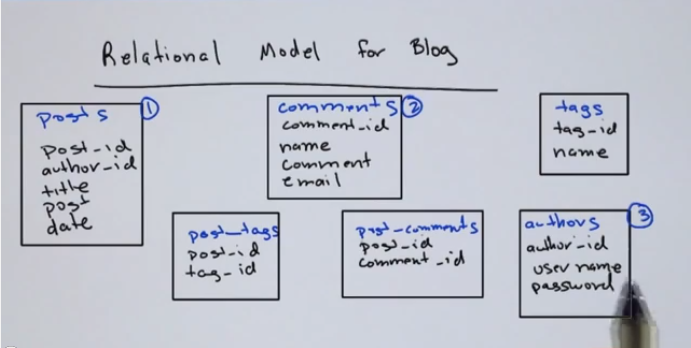
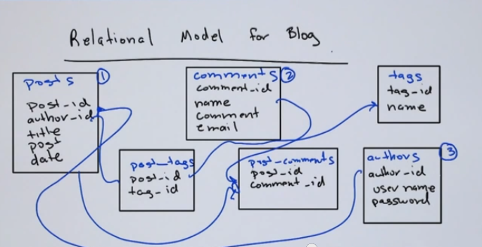
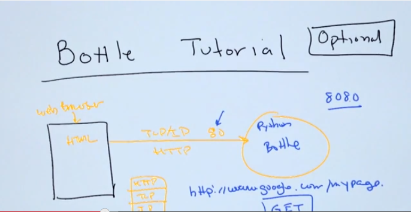

# Week 1: Introduction

## Welcome to M101P

- 7 week class
- Python code

### Logistics & Scoring
- Video Lectures (available on Youtube) ~ 2hs / week = 0%
- Quizzes after each video = 0%
- Homeworks = 50% (Drop Lowest)
- Final Exam = 50%

With a score greater than 65%, you get a 10gen completion certificate.

### Quiz: Welcome to M101P

What counts towards your final grade in the class?
- Quizzes
- **Homeworks**
- **Final Exam**
- Class Participation

## What is MongoDB?

- Non Relational datastore for **JSON** documents.
- **JSON** stands for JavaScript Object Notation
- Key-value storage

Examples:

	{"name": "Andrew"}

	{"a": 4,
	 "b": 5,
	 "c": 7}

JSON documents can have some kind of hierarchy:

	{a: 6,
	 b: 7,
	 fruit: ["apple", "pear", "banana"]}

Relational data is usually a series of tables (columns and rows).

**MongoDB is Schemaless**

Different documents can have different schemas.

### Quiz: What is MongoDB?

Which of the following statements are true about MongoDB?

- **MongoDB is document oriented.**
- MongoDB supports Joins.
- **MongoDB has dynamic schema.**
- MongoDB supports SQL.

## MongoDB Relative to Relational

Scalability & Performance vs Depths of Functionality

- Scalability & Performance = memcached, key-value store
- Depth of Functionality = RDBms (ie. Oracle)

MongoDB doesn't support:
- **Joins**: joins scale poorly.
- **Transactions**.

### Quiz: MongoDB Relative to Relational

Which features did MongoDB omit in order to retain scalability?

- **Joins**
- Indexes
- Secondary Indexes
- **Transactions across multiple collections**

Joins are not particulary horizontally scalable.
Indexes are supported within MongoDB, they're neccesary for good performance, and they allow horizontal scalable.

## Overview of Building an App with MongoDB

- **mongod** process
- **mongo shell**, connects to mongod and allows you to interact with it
- Python: bottle, pymongo

## Quick introduction to the Mongo Shell

	# mongo
	Connecting to: test
	> use test
	switched to db test
	> db.things.save({a:1, b:2, c:3}
	> db.things.find()
	{ "_id": ObjectID("..."), "a": 1, "b": 2, "c": 3 }

### Quiz: Quick introduction to the Mongo Shell

Which of the following expressions are valid JSON documents?

- **{a:1, b:2, c:3}**
- {a,1; b,4, c,6}
- {a:1; b:1; c:4}
- (A,1; b:2; c,4}

## Introduction to JSON

### Quiz: Introduction to JSON

Which of the following are valid JSON documents?

- **{a:1, b:2, c: 3}**
- **{a:1, b:2, c:[1,2,3,4,5]}** The third key has a value within an array.
- **{a:1, b:{}, c: [ { a:1, b:2}, 5, 6]}** The value for the b key is an empty JSON document. The value for the c key is an array with 1 JSON document and 2 values.
- **{ }** Empty JSON document.

## Installing MongoDB (mac)

Download the latest stable version:

	tar xvf mongodb-osx-x86_64-2.4.8.tgz

For development environment:

	sudo $SHELL 
	mkdir -p /data/db
	chmod 777 /data/db
	ls -ld /data/db

Run the `mongod` process and check it's up and running:

	# bin $ ./mongod

Open another terminal and do some testing:

	# bin $
	MongoDB shell version: 2.4.8
	connecting to: test
	Welcome to the MongoDB shell.
	For interactive help, type "help".
	For more comprehensive documentation, see
		http://docs.mongodb.org/
	Questions? Try the support group
		http://groups.google.com/group/mongodb-user
	> db.names.save({'name':'javier'})
	> db.names.find()
	{ "_id" : ObjectId("5299c864071a97a435a8a277"), "name" : "javier" }
	>
## Installing Bottle and Python

`Bottle` is a Python web framework.

Installing:

	pip install bottle

Example code:

	from bottle import route, run, template

	@route('/hello/<name>')
	def index(name='World'):
    	return template('<b>Hello {{name}}</b>!', name=name)

	run(host='localhost', port=8080)

Run it:

	python hello_world.py

Test it:

- Open a browser
- Type: `localhost:8080/hello/foo`

## Installing PyMongo (mac)

- MondoDB installed, running as `mondod` process.
- Application, writted in Python using the bottle framework. Allows to get HTTP requests.

PyMongo is the driver that connects the application and the DB.

Install:

	# Download:
	api.mongodb.org/python/current

	# Pip: 	
	pip install pymongo

## Hello World on a Web Server

Run:

	# bin $ ./mongod

Open browser:

	localhost:8082

Modify the content in the mongodb:
	
	$ ./mongo
	MongoDB shell version: 2.4.8
	connecting to: test
	> db.names.find()
	{ "_id" : ObjectId("5299c864071a97a435a8a277"), "name" : "javier" }
	> var j = db.names.findOne()
	> j.name = "Dwight"
	Dwight
	> db.names.save(j)
	> var j = db.names.findOne()
	> j
	{ "_id" : ObjectId("5299c864071a97a435a8a277"), "name" : "Dwight" }
	> var j = db.names.findOne()
	> j.name = "Andrew"
	Andrew
	> db.names.save(j)
	> j
	{ "_id" : ObjectId("5299c864071a97a435a8a277"), "name" : "Andrew" }
	>

Refresh the URL and check the changes.

## JSON Revisited

Data structures:

- **Arrays**: lists of things `[...]`
- **Dictionaries**: associated maps `{ keyword:value,}`

### Quiz: JSON Revisited

Write the JSON for a simple document containing a single "fruit" that has as its value an array containing three strings: "apple", "pear", and "peach":

	{"fruit": ["apple", "pear", "peach"]}	

## JSON Subdocuments

### Quiz: JSON Subdocuments

Write a JSON document with a single key, "address" that has as it value another document with the keys “street_address”, “city”, “state”, “zipcode”, with the following values: “street_address” is "23 Elm Drive", “city” is "Palo Alto", “state” is "California", “zipcode” is "94305":

	{"address": {"street_address": "23 Elm Drive",
    	         "city": "Palo Alto",
        	     "state": "California",
            	 "zipcode": "94305"}
	}

## JSON Spec

	www.json.org

## Blog in Relational TablesTables

### Quiz: Blog in Relational TablesTables

Let’s assume that our blog can be modeled with the following relational tables:

    authors:
    	author_id,
    	name,
    	email,
    	password
    
    posts:
    	post_id,
    	author_id
    	title,
    	body,	
    	publication_date
    
    comments:
    	comment_id,
    	name, 
    	email,
    	comment_text
    
    post_comments:
    	post_id,
    	comment_id
    
    
    tags
    	tag_id
    	name
    
    post_tags
    	post_id
    	tag_id    

In order to display a blog post with its comments and tags, how many tables will need to be accessed?

- 2
- 3
- 5
- **6**

In order to show a blog post with all of its comments and tags, you'd have to hit the `post` table. Only an author ID here, so you have to access the `authors` table in order to get the author`s name.

You'd have to go to the `comments` table to display the comments. And to know which comments go with which post, you'd have to go to the `post_comments` table.

And to know what post tags you had, you have to go to the `post_tags` table, the tags themselves are in the `tags` table.

## Blog in Documents

post 
    
	{title: "Free online classes", 
     body: "...",
     author: "javier",
     date: "...", 
     comments: [{name: "Joe Biden",
                 email: "joe@whitehouse.gov",
                 comment: "..."},
                {...}],
     tags: ["cycling", "education", "startups"]}

authors

    {_id: "javier",
     password: "..."}

### Quiz: Blog in Documents

Given the document schema that we proposed for the blog, how many collections would we need to access to display the blog home page?

- 0
- **1*
- 2
- 4

Only the "post" collection. We don't have to access the "authors" collection, because we have the authors name within the "post". 

## Introduction to Schema Design

### Quiz: Introduction to Schema Design

In which scenario is it impossible to embed data within a document (you must put the data in it a separate collection)? Check all that apply.

- The data would be duplicated across multiple objects within a collection.
- You need an index on the data element.
- **The embedded data could exceed the 16MB document limit within MongoDB.**
- The data is not isomorphic.

## Introduction to Python

- Readable
- Garbage collected
- Dynamically tiped

### Quiz: Introduction to Python

Write an expression to concatenate two strings "hat" and "pin" in Python to the string "hatpin"

	"hat" + "pin"

## Python Lists

### Quiz: Python Lists

Write the to code to initialize a list with the items "hammer", "nail" and "wall" and assign the list to the variable named "things".

	things = ["hammer", "nail", "wall"]

## Python Lists, Slice Operator

	a[start:end]
	inclusive:exclusive

Example:

	> a = [0, 1, 2, 3, 4, 5]
	> a[0:3]
	[0, 1, 2]	
	> a[2:3]
	[2]
	> a[2:]
	[2, 3, 4, 5]
	> a[:6]
	[0, 1, 2, 3, 4, 5]
	> a[:]
	[0, 1, 2, 3, 4, 5]
	
### Quiz: Python Lists, Slice Operator

things = ['apples', 'orange', 'pear', 'grape', 'kiwi']. What is the slice notation that will return the sublist ['orange', 'pear']?

	things[1:3]

## Python Lists, Inclusion
	
	>>> a = ['apple', 'pear', 'orange']
	>>> 'pear' in a
	True
	>>> 'grape' in a
	False
	>>> if 'pear' in a:
	...    print("There is a pear")
	...
	There is a pear
	>>> if 'grape' in a:
	... print("There is a grape"
	...
	>>>
### Quiz: Python Lists, Inclusion

Given a Python list called "fruit", write an if statement to check whether "apple" is in the list.
Please use double quotes at this time.

	if "apple" in fruit:

## Bottle Framework: URL Handlers

Test 1: /

	$ curl -i localhost:8080   [13:58:12]
	HTTP/1.0 200 OK
	Date: Sat, 30 Nov 2013 12:59:11 GMT
	Server: WSGIServer/0.1 Python/2.7.3
	Content-Length: 12
	Content-Type: text/html; charset=UTF-8

	Hello World
	$

Test 2: /testpage:

	$ curl -i localhost:8080/testpage
	HTTP/1.0 200 OK
	Date: Sat, 30 Nov 2013 13:00:26 GMT
	Server: WSGIServer/0.1 Python/2.7.3
	Content-Length: 19
	Content-Type: text/html; charset=UTF-8

	this is a test page%
